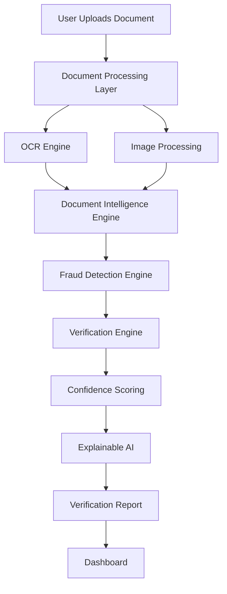
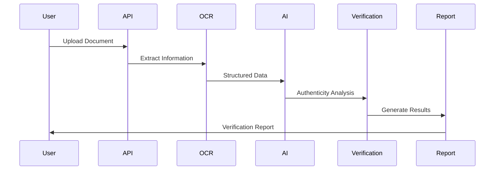

<h1 align="center">🛡️ Verilex AI</h1>

<h3 align="center">
AI-Powered Document Intelligence & Verification Platform
</h3>

<p align="center">
Verify authenticity. Detect fraud. Build trust.
</p>

<br>

<p align="center">


</p>

<p align="center">


</p>

---

# 🛡️ About Verilex AI

Every day, millions of documents are submitted for admissions, recruitment, banking, insurance, government services, and identity verification. Unfortunately, manual verification is often slow, expensive, and vulnerable to sophisticated document fraud.

**Verilex AI** is an AI-powered Document Intelligence Platform designed to automate the verification process while improving accuracy, transparency, and trust.

Instead of relying solely on manual inspection, Verilex AI combines Artificial Intelligence, Computer Vision, Optical Character Recognition (OCR), and intelligent validation techniques to analyze documents, detect inconsistencies, and assist organizations in making confident verification decisions.

Whether it's identifying tampered documents, extracting critical information, or validating document authenticity, Verilex AI transforms document verification into a faster, smarter, and more reliable process.

---

# 🌍 Vision

> **Creating a future where trust is verified by intelligence—not assumptions.**

Our vision is to build a secure verification ecosystem where organizations can instantly validate official documents with the assistance of explainable AI, reducing fraud while improving operational efficiency.

Verilex AI aims to become an intelligent verification layer that seamlessly integrates into industries such as:

- 🏦 Banking & Financial Services
- 🎓 Educational Institutions
- 🏢 Enterprise Recruitment
- 🏥 Healthcare
- 🛂 Government Agencies
- 📑 Legal & Compliance
- 🌐 Digital Identity Platforms

---

# ❗ The Problem

Document fraud continues to grow more sophisticated, while verification processes remain heavily dependent on manual review.

Organizations frequently encounter challenges such as:

- Forged identity documents
- Edited certificates and marksheets
- Manipulated PDFs
- Fake employment records
- Time-consuming manual verification
- Human error in validation
- High operational costs
- Delayed onboarding processes

Traditional verification systems often focus on simple OCR extraction without evaluating whether a document itself can be trusted.

Verilex AI addresses this gap by introducing intelligence into the verification pipeline.

---

# 🚀 Core Features

## 📄 Intelligent Document Analysis

- Automated document parsing
- AI-assisted document understanding
- OCR-powered text extraction
- Structured information detection
- Intelligent metadata analysis

---

## 🔍 Fraud Detection

- Document authenticity assessment
- Tampering detection
- Image manipulation analysis
- Suspicious content identification
- Consistency validation

---

## 🤖 Artificial Intelligence

- Machine Learning-based verification
- Computer Vision analysis
- Explainable AI reasoning
- Confidence scoring
- Intelligent verification pipeline

---

## ⚡ Automation

- Instant verification workflows
- Reduced manual effort
- Faster processing
- Automated decision support
- Scalable verification pipeline

---

## 📊 Reporting

- Verification summaries
- AI confidence scores
- Fraud indicators
- Structured verification reports
- Decision insights

---

# 💡 Why Verilex AI?

Most document verification systems stop after extracting text.

Verilex AI goes a step further by asking:

> **"Can this document actually be trusted?"**

Instead of simply reading information, the platform evaluates authenticity through multiple layers of intelligent analysis, helping organizations identify potential fraud before it becomes a risk.

By combining AI-driven verification with explainable decision making, Verilex AI empowers users with both automation and confidence.

---

# 🎯 Potential Applications

<table>
<tr>

<td width="50%">

### 🏦 Banking

- KYC Verification
- Loan Processing
- Customer Onboarding

</td>

<td width="50%">

### 🎓 Education

- Degree Verification
- Certificate Validation
- Student Admissions

</td>

</tr>

<tr>

<td>

### 🏢 Enterprises

- Employee Background Verification
- Resume Validation
- HR Document Screening

</td>

<td>

### 🏛 Government

- Identity Verification
- Citizen Services
- Digital Documentation

</td>

</tr>

</table>

---

# 🌟 Project Highlights

- 🧠 AI-Powered Verification
- 🔍 Intelligent Fraud Detection
- 📄 OCR-Based Information Extraction
- 🛡️ Security-Focused Design
- ⚡ Automated Verification Workflow
- 📊 Explainable Decision Support
- 🔒 Trust-Centric Architecture
- 🌍 Scalable Enterprise Vision

---

# 🚧 Development Status

> **Verilex AI is actively evolving into a comprehensive Document Intelligence Platform.**

Current development focuses on strengthening AI-assisted verification capabilities, improving fraud detection accuracy, enhancing explainability, and building a scalable architecture suitable for enterprise-grade deployments.

---

<p align="center">

## "Trust isn't built by checking documents. It's built by understanding them."

</p>
---

# 🏛️ System Architecture

Verilex AI is designed using a modular architecture where each subsystem has a clearly defined responsibility. Rather than combining OCR, Machine Learning, and validation into a monolithic application, every stage of the verification pipeline operates independently, making the platform scalable, maintainable, and easy to extend.



---

# 🧠 AI Verification Pipeline

Every uploaded document follows a structured intelligence pipeline before a verification decision is generated.

```text

Document Upload

↓

Preprocessing

↓

Image Enhancement

↓

OCR Extraction

↓

Document Classification

↓

Forgery Analysis

↓

Feature Validation

↓

Fraud Detection

↓

Confidence Scoring

↓

Explainable AI

↓

Verification Report

```

---

# ⚙️ Technology Stack

## Frontend

| Technology | Purpose |
|------------|---------|
| React | User Interface |
| TypeScript | Type Safety |
| Tailwind CSS | Styling |
| Vite | Development Environment |

---

## Backend

| Technology | Purpose |
|------------|---------|
| Node.js | Runtime |
| Express.js | REST APIs |
| MongoDB | Data Storage |
| JWT | Authentication |
| Multer | File Uploads |

---

## Artificial Intelligence

| Technology | Purpose |
|------------|---------|
| Python | AI Processing |
| OpenCV | Image Analysis |
| TensorFlow / PyTorch | Deep Learning |
| OCR Engine | Text Extraction |
| NumPy | Numerical Computing |
| Pandas | Data Processing |

---

## Security

| Technology | Purpose |
|------------|---------|
| JWT Authentication | Secure Access |
| Password Hashing | User Security |
| Input Validation | Data Integrity |
| Secure File Upload | Document Protection |

---

# 📂 Project Structure

```text

Verilex-AI/

│

├── client/

│ ├── src/

│ ├── assets/

│ ├── components/

│ ├── pages/

│ ├── hooks/

│ └── services/

│

├── server/

│ ├── controllers/

│ ├── routes/

│ ├── middleware/

│ ├── models/

│ ├── services/

│ └── config/

│

├── ai/

│ ├── models/

│ ├── preprocessing/

│ ├── ocr/

│ ├── fraud_detection/

│ ├── verification/

│ └── utils/

│

├── docs/

├── public/

└── README.md

```

---

# 🔍 Verification Workflow



---

# 🧩 Core Intelligence Modules

| Module | Responsibility |
|----------|----------------|
| 📄 Document Parser | Reads uploaded documents |
| 🔠 OCR Engine | Extracts textual information |
| 🖼 Image Analyzer | Detects visual inconsistencies |
| 🤖 AI Verification Engine | Understands document structure |
| 🚨 Fraud Detection Engine | Detects manipulation and anomalies |
| 📊 Confidence Engine | Calculates authenticity probability |
| 📝 Report Generator | Produces verification reports |
| 📈 Analytics Engine | Stores verification insights |

---

# 🔒 Security Architecture

Security is a core design principle of Verilex AI.

The platform is designed to protect sensitive documents throughout the verification lifecycle.

### Authentication

- JWT Authentication
- Secure Session Management
- Role-Based Access Control

---

### File Protection

- Secure Upload Validation
- File Type Verification
- Malware Prevention Layer
- Temporary File Isolation

---

### Data Protection

- Password Hashing
- Encrypted Storage
- Secure API Communication
- Validation Middleware

---

### AI Integrity

- Confidence Scoring
- Explainable Decisions
- Verification Traceability
- Fraud Evidence Recording

---

# 🧠 Artificial Intelligence Workflow

The AI subsystem combines multiple intelligence techniques instead of relying on a single machine learning model.

### Image Intelligence

- Image preprocessing
- Noise reduction
- Resolution enhancement
- Contrast normalization

---

### OCR Intelligence

- Text extraction
- Layout understanding
- Field detection
- Structured parsing

---

### Verification Intelligence

- Pattern matching
- Document consistency analysis
- Metadata validation
- Rule-based verification

---

### Fraud Intelligence

- Edited document detection
- Image tampering analysis
- Forgery indicators
- Confidence estimation

---

# 📊 Performance Goals

| Metric | Target |
|----------|---------|
| Verification Accuracy | >95% |
| OCR Accuracy | >98% |
| Average Processing Time | <5 seconds |
| Fraud Detection Precision | >93% |
| API Response Time | <300 ms |
| System Availability | 99.9% |

---

# 🏗️ Engineering Principles

Verilex AI is built with long-term scalability and maintainability in mind.

### ✅ Modular Design

Independent verification components with clear responsibilities.

---

### ✅ Clean Architecture

Business logic remains isolated from frameworks and infrastructure.

---

### ✅ Explainable AI

Every verification decision is accompanied by confidence scores and reasoning.

---

### ✅ Provider Independence

AI components are abstracted, allowing different OCR engines or machine learning models to be integrated without changing application logic.

---

### ✅ Scalable Design

The architecture supports future additions such as:

- Digital Signature Verification
- QR Code Validation
- Face Matching
- Blockchain Verification
- Multi-document Analysis
- Enterprise API Gateway

---

# 🚧 Current Development Status

| Component | Status |
|------------|--------|
| User Authentication | ✅ Complete |
| Document Upload | ✅ Complete |
| OCR Integration | ✅ Complete |
| AI Verification Engine | 🚧 In Progress |
| Fraud Detection | 🚧 In Progress |
| Explainable AI | 📅 Planned |
| Analytics Dashboard | 📅 Planned |
| Enterprise API | 📅 Planned |

---

# 💎 Why Verilex AI?

Most verification tools answer one question:

> **"What information does this document contain?"**

Verilex AI answers a much more important question:

> **"Can this document be trusted?"**

By combining document understanding, visual analysis, fraud detection, and explainable AI, Verilex AI transforms verification into an intelligent decision-making process rather than simple data extraction.

---
---

# 🚀 Getting Started

Follow these instructions to set up Verilex AI on your local machine.

## Prerequisites

Before you begin, make sure you have:

- Node.js (v18+)
- Python (v3.10+)
- Git
- MongoDB
- npm or pnpm

---

## Clone the Repository

```bash
git clone https://github.com/gulshanverse/verilex-ai.git

cd verilex-ai
```

---

## Install Dependencies

### Frontend

```bash
cd client

npm install
```

### Backend

```bash
cd ../server

npm install
```

### AI Module

```bash
cd ../ai

pip install -r requirements.txt
```

---

## Environment Variables

Create a `.env` file inside the server directory.

```env

PORT=5000

MONGO_URI=

JWT_SECRET=

CLIENT_URL=http://localhost:5173

OPENAI_API_KEY=

GOOGLE_API_KEY=

```

---

## Start Development

### Backend

```bash

npm run dev

```

### Frontend

```bash

npm run dev

```

### AI Service

```bash

python app.py

```

---

# 🌐 REST API Overview

| Method | Endpoint | Description |
|---------|----------|-------------|
| POST | `/api/auth/register` | Register user |
| POST | `/api/auth/login` | Login user |
| POST | `/api/documents/upload` | Upload document |
| POST | `/api/verify` | Start verification |
| GET | `/api/report/:id` | Fetch verification report |
| GET | `/api/history` | Verification history |

---

# 📄 Verification Report

Each processed document generates a structured report containing:

- Document Type
- Extracted Information
- OCR Confidence
- Fraud Indicators
- AI Confidence Score
- Verification Status
- Processing Timestamp
- Detailed Analysis Summary

---

# 📊 Performance Targets

| Metric | Goal |
|---------|------|
| Verification Accuracy | 95%+ |
| OCR Accuracy | 98%+ |
| Average Processing Time | Under 5 Seconds |
| Fraud Detection Precision | 93%+ |
| API Response Time | Under 300 ms |
| Availability | 99.9% |

---

# 🔮 Future Roadmap

## Phase 1 ✅

- User Authentication
- Document Upload
- OCR Integration
- Basic Verification
- Verification Reports

---

## Phase 2 🚧

- Advanced Fraud Detection
- Explainable AI
- Confidence Scoring
- Smart Verification Engine
- Dashboard Analytics

---

## Phase 3

- Face Verification
- Signature Verification
- QR & Barcode Validation
- Multi-document Correlation
- Batch Verification

---

## Phase 4

- Blockchain-based Verification
- Enterprise APIs
- Government Integration
- Bank Verification APIs
- University Verification Portal
- Real-time Monitoring Dashboard

---

# 🧪 Testing

Run all tests

```bash

npm test

```

Run backend tests

```bash

npm run test:server

```

Run frontend tests

```bash

npm run test:client

```

Run linting

```bash

npm run lint

```

---

# 🤝 Contributing

Contributions are welcome.

If you'd like to improve Verilex AI:

1. Fork the repository.

2. Create a new feature branch.

```bash

git checkout -b feature/new-feature

```

3. Commit your changes.

```bash

git commit -m "feat: add new feature"

```

4. Push to your branch.

```bash

git push origin feature/new-feature

```

5. Open a Pull Request.

Please ensure that all tests pass before submitting your contribution.

---

# 🛡 Security

If you discover a security vulnerability, please report it responsibly instead of opening a public issue.

We appreciate responsible disclosure that helps improve the platform while protecting users.

---

# 📜 License

This project is licensed under the **MIT License**.

See the **LICENSE** file for additional details.

---

# 👨‍💻 Author

<div align="center">

# Gulshan Kumar

### Software Engineer • AI/ML Engineer • Full Stack Developer

Building intelligent software systems that combine Artificial Intelligence, Machine Learning, and scalable software engineering to solve real-world problems.

</div>

---

# ⭐ Support the Project

If you found this project valuable:

⭐ Star the repository

🍴 Fork the project

📝 Open an issue

💡 Suggest improvements

🤝 Contribute to development

Every contribution helps make Verilex AI smarter, more secure, and more reliable.

---

<div align="center">

# 🛡️ Verilex AI

### *"Trust is earned through intelligence, not assumption."*

---

**Built with ❤️ using Artificial Intelligence, Machine Learning, Computer Vision, and Modern Software Engineering.**

</div>
